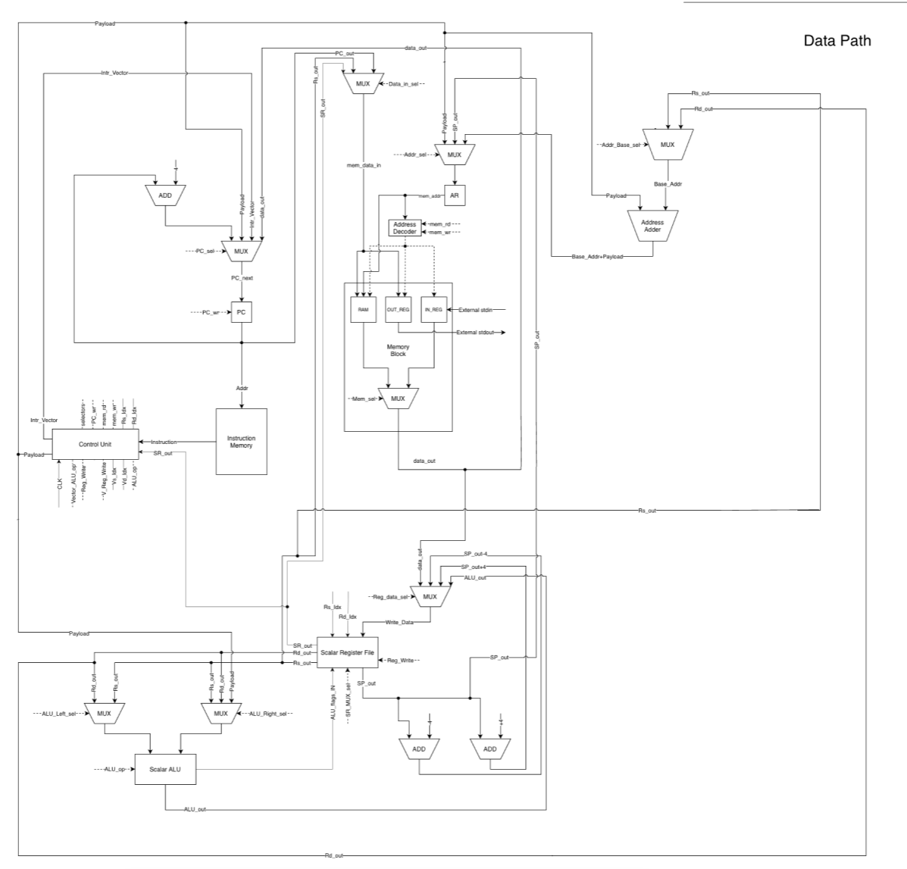
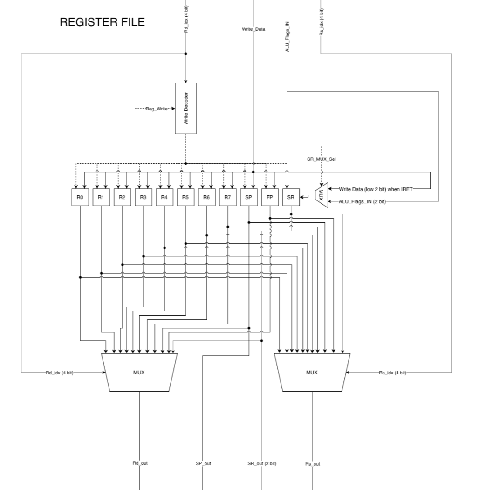
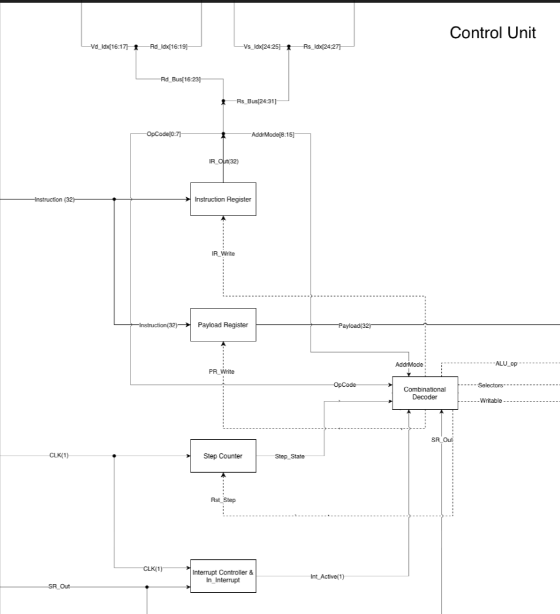

# AK_lab4
# Лабораторная работа №4. Эксперимент

## Григорьев Даниил Александрович, группа P3216
## alg | cisc | harv | hw | tick | binary | trap | mem | pstr | prob2 | s̶u̶p̶e̶r̶s̶c̶a̶l̶a̶r̶

## Содержание

1. [Особенности реализации варианта](#особенности-реализации-варианта)
    * [Язык программирования](#1-язык-программирования-alg)
    * [Система команд](#2-система-команд-cisc)
    * [Архитектура организации памяти](#3-архитектура-организации-памяти-harv)
    * [Управляющее устройство](#4-управляющее-устройство-hw)
    * [Точность моделирования](#5-точность-моделирования-tick)
    * [Представление машинного кода](#6-представление-машинного-кода-binary)
    * [Ввод-вывод](#7-ввод-вывод-trap)
    * [Ввод-вывод ISA](#8-ввод-вывод-isa-mem)
    * [Поддержка строк](#9-поддержка-строк-pstr)
    * [Алгоритм](#10-алгоритм-prob2)
    * [Усложнение](#11-усложнение-superscalar)
2. [Язык программирования](#язык-программирования)
    * [Описание синтаксиса (BNF)](#формальная-бэкуса-наура-bnf-грамматика)
    * [Семантика языка](#семантика-языка)
3. [Организация памяти и жизненный цикл сущностей](#организация-памяти-и-жизненный-цикл-сущностей)
    * [Литералы](#1-литералы-literals)
    * [Константы](#2-константы-constants)
    * [Переменные](#3-переменные-variables)
    * [Инструкции](#4-инструкции-instructions)
    * [Процедуры](#5-процедуры-procedures--functions)
    * [Прерывания](#6-прерывания-interrupts)
4. [Система команд (ISA)](#система-команд-isa)
    * [Особенности архитектуры процессора](#1-особенности-архитектуры-процессора)
        * [Типы данных и машинных слов](#типы-данных-и-машинных-слов)
        * [Устройство регистров](#устройство-регистров)
        * [Режимы адресации](#режимы-адресации)
        * [Устройство ввода-вывода](#устройство-ввода-вывода-mmio)
        * [Поток управления и система прерываний](#поток-управления-и-система-прерываний-trap)
    * [Описание кодирования инструкций](#2-описание-кодирования-инструкций)
    * [Классификация системы команд](#3-классификация-системы-команд)
    * [Набор инструкций и такты выполнения](#4-набор-инструкций-и-такты-выполнения)
    * [Потактовое выполнение инструкций](#5-потактовое-выполнение-инструкций-takt-by-takt)
5. [Транслятор](#транслятор)
    * [Интерфейс командной строки](#1-интерфейс-командной-строки-cli)
    * [Принципы и этапы работы транслятора](#2-принципы-и-этапы-работы-транслятора)
        * [Токенизация](#этап-1-токенизация)
        * [Построение абстрактного синтаксического дерева](#этап-2-построение-ast-parsing)
        * [Компиляция и линковка](#этап-3-компиляция-и-линковка)
6. [Модель процессора](#модель-процессора)
    * [Интерфейс командной строки](#1-интерфейс-командной-строки-cli-1)
    * [Описание регистров, флагов и сигналов](#2-описание-регистров-флагов-и-сигналов)
    * [Особенности реализации процесса моделирования](#3-особенности-реализации-процесса-моделирования)
    * [Схемы процессора и их описание](#4-схемы-процессора-и-их-описание)
7. [Тестирование](#тестирование)
    * [Краткое описание разработанных тестов](#1-краткое-описание-разработанных-тестов)
    * [Golden-тесты реализованных алгоритмов](#2-golden-тесты-реализованных-алгоритмов)
    * [Пример использования разработанной инструментальной цепочки](#3-пример-использования-разработанной-инструментальной-цепочки)

---

## Особенности реализации варианта

### 1. Язык программирования (`alg`)

* **Требование варианта:** Синтаксис языка должен напоминать Java/JavaScript/Lua и поддерживать сложные математические выражения. В тестах необходимо проверять человекочитаемое AST.
* **Особенности реализации:**
    * **Конструкции высокого уровня:** Язык `alg` поддерживает типизированные переменные (`int`, `string`), ветвления (`if`/`else`), циклы (`while`), вызовы функций (`fn`), возвраты значений (`return`) и обработчики прерываний (`on_input`).
    * **Системные встроенные функции (Built-ins):** Для низкоуровневой работы с железом реализованы функции `read_io(addr)`, `write_io(addr, val)`, `allocate_buffer(size)` и вызовы управления прерываниями `enable_interrupts()`, `disable_interrupts()`.
    * **Стековые кадры для рекурсии:** Все локальные переменные компилируются во фреймы стека относительно регистра `A6` (Frame Pointer) со смещением `[A6 - offset]`, что полностью изолирует контекст рекурсивных вызовов.

---

### 2. Система команд (`cisc`)

* **Требование варианта:** Наличие сложных инструкций, работающих с регистрами и памятью за одну операцию. Переменная длина команд и считывание нескольких слов при выборке.
* **Особенности реализации:**
    * **Переменная длина инструкций:** Инструкции кодируются заголовком (2 байта: `[OpCode] [OperandCount]`) и переменным количеством байт для каждого операнда. Команда без операндов (`NOP`, `HALT`) занимает 2 байта, а сложная команда косвенной адресации со смещением - до 14 байт.
    * **Сложная адресация:** Команды `MOVE`, `ADD` и др. поддерживают адресацию `IND_A_DISP` (`[An + offset]`), которая вычисляется процессором за 1 такт на аппаратном уровне.

---

### 3. Архитектура организации памяти (`harv`)

* **Требование варианта:** Гарвардская архитектура (раздельная память команд и данных).
* **Особенности реализации:**
    * **Физическое разделение:** Память команд `self.code` (последовательность байт) и память данных `self.data_memory` (байтовый массив слов `bytearray` объемом 16 КБ) полностью изолированы друг от друга в классе `Machine`.
    * **Выравнивание данных:** Память данных адресуется побайтово, но чтение и запись слов (`read_word`/`write_word`) строго выровнены по 4-байтовой границе, что верифицируется аппаратно.

---

### 4. Управляющее устройство (`hw`)

* **Требование варианта:** Жесткая логика управления (Hardwired Control Unit).
* **Особенности реализации:**
    * **Декодер на жесткой логике:** Управляющее устройство в методе `Machine.step()` представляет собой конечный автомат, логика работы которого зафиксирована аппаратно. При декодировании OpCode напрямую активируется соответствующая ветка выполнения, имитируя прохождение сигналов дешифратора к АЛУ и памяти.

---

### 5. Точность моделирования (`tick`)

* **Требование варианта:** Моделирование процессора с точностью до такта (`tick`).
* **Особенности реализации:**
    * **Потактовый симулятор:** Каждая микрооперация (выборка, декодирование, обращение к памяти данных, запись флагов) увеличивает счетчик тактов `tick_counter` на фиксированные задержки синхросигнала: `NOP` = 1 такт, `MOVE` = 2 такта, `ALU` = 2 такта, `CALL` = 3 такта, `IRET` = 4 такта.

---

### 6. Представление машинного кода (`binary`)

* **Требование варианта:** Настоящие бинарные файлы. Требуется отладочный вывод в текстовый файл вида `<address> - <HEXCODE> - <mnemonic>`.
* **Особенности реализации:**
    * **Бинарный формат:** Выходной файл транслятора пакуется с помощью модуля `struct` в Little-Endian. Он снабжен 12-байтовым заголовком секций: `[Размер кода (4B)] [Размер данных (4B)] [Вектор прерывания (4B)]`.
    * **Отладочный текстовый дамп:** Компилятор генерирует файл `<program>.bin.txt`, содержащий точные байтовые адреса, шестнадцатеричные HEX-коды инструкций и соответствующие мнемоники ассемблера.

---

### 7. Ввод-вывод (`trap`)

* **Требование варианта:** Ввод-вывод осуществляется токенами через систему прерываний по расписанию тактов.
* **Особенности реализации:**
    * **Асинхронные TRAP-прерывания:** При совпадении счетчика тактов с запланированным временем ввода срабатывает прерывание. CPU сохраняет адрес возврата `PC` и упакованный регистр флагов `SR` на стек, взводит триггер `in_interrupt_handler` и переходит к обработчику `on_input()`.
    * **Автоматическая генерация IRET:** Обработчик прерывания `on_input` компилируется со специальным эпилогом, завершающимся инструкцией `IRET`, которая корректно восстанавливает состояние флагов и `PC`.

---

### 8. Ввод-вывод ISA (`mem`)

* **Требование варианта:** Memory-Mapped I/O (порты отображаются в память данных).
* **Особенности реализации:**
    * **Маскирование адресов:** Адреса портов `0xFFFF0000` (ввод) и `0xFFFF0008` (вывод) маскируются на аппаратном уровне операцией `address & 0xFFFFFFFF`. Это устраняет конфликты знакового сравнения и позволяет процессору прозрачно работать с MMIO через стандартные команды обращения к памяти.

---

### 9. Поддержка строк (`pstr`)

* **Требование варианта:** Pascal-style строки (префикс длины).
* **Особенности реализации:**
    * **Секция статических данных:** Строковые литералы преобразуются транслятором в структуру Pascal-строки: первое слово (4 байта) хранит длину строки, а последующие слова - ASCII-коды символов. Адрес строки в ОЗУ передается в регистр результатов `D0`.

---

### 10. Алгоритм (`prob2`)

* **Постановка задачи:**
  Найдите разность между суммой квадратов первых ста натуральных чисел и квадратом их суммы.
* **Исходный код:** `examples/euler6.alg`
* **Математическая оптимизация O(1):**
  Прямой перебор в цикле от `1` до `100` требует сотен тактов. Для достижения мгновенного выполнения применена математическая формула:
  $$\sum_{i=1}^n i = \frac{n(n + 1)}{2}$$
  $$\sum_{i=1}^n i^2 = \frac{n(n + 1)(2n + 1)}{6}$$
  Это позволило вычислить результат всего за **967 тактов** для $n=10$, полностью исключив накладные расходы на итерации циклов.

---

## Язык программирования

Разработанный язык программирования `alg` представляет собой императивный язык высокого уровня с C-подобным синтаксисом.

### Формальная Бэкуса-Наура (BNF) грамматика

```bnf
<program>       ::= <function>*
<function>      ::= "fn" <type> <identifier> "(" <params>? ")" <block>
<type>          ::= "void" | "int" | "string"
<params>        ::= <param> ( "," <param> )*
<param>         ::= <type> <identifier>

<block>         ::= "{" <statement>* "}"
<statement>     ::= <var_decl>
                  | <assignment>
                  | <if_statement>
                  | <while_loop>
                  | <return_statement>
                  | <expr_stmt>
                  | <block>

<var_decl>      ::= <type> <identifier> ( "=" <expression> )? ";"
<assignment>    ::= <identifier> "=" <expression> ";"
<if_statement>  ::= "if" "(" <expression> ")" <block> ( "else" <block> )?
<while_loop>    ::= "while" "(" <expression> ")" <block>
<return_statement> ::= "return" <expression>? ";"
<expr_stmt>     ::= <expression> ";"

<expression>    ::= <equality>
<equality>      ::= <comparison> ( ( "==" | "!=" ) <comparison> )*
<comparison>    ::= <term> ( ( "<" | "<=" | ">" | ">=" ) <term> )*
<term>          ::= <factor> ( ( "+" | "-" ) <factor> )*
<factor>        ::= <unary> ( ( "*" | "/" | "%" ) <unary> )*
<unary>         ::= ( "-" )? <primary>
<primary>       ::= <number>
                  | <string_literal>
                  | <identifier>
                  | <identifier> "(" <args>? ")"
                  | "(" <expression> ")"

<args>          ::= <expression> ( "," <expression> )*
```

### Семантика языка

* **Области видимости:** Все переменные внутри функций локальные и размещаются на стеке. Общая память между `main` и прерыванием `on_input` адресуется напрямую через низкоуровневые порты в ОЗУ.
* **Передача параметров:** Выполняется по значению через стек в обратном порядке (конвенция CDECL).
* **Типизация:** Статическая. Поддерживаются знаковые 32-битные целые числа `int` и Pascal-строки `string` в памяти данных.

---

## Организация памяти и жизненный цикл сущностей

Память организована по Гарвардской схеме.

### 1. Литералы (Literals)
* **Числовые литералы:** На этапе компиляции упаковываются в 4-байтовый Payload инструкции (`AddressingMode.IMMEDIATE`). Во время выполнения извлекаются из памяти команд за один дополнительный такт.
* **Строковые литералы:** Извлекаются из AST и размещаются последовательно в начале статической памяти данных. Каждой строке выделяется блок: первое слово - длина строки, далее - ASCII-коды символов. В коде генерируется инструкция загрузки базового адреса строки в `D0`.

### 2. Константы (Constants)
Адреса MMIO зафиксированы аппаратно: `0xFFFF0000` (ввод) и `0xFFFF0008` (вывод). Обращения к ним перехватываются шиной процессора и транслируются в буферы симулятора.

### 3. Переменные (Variables)
Все локальные переменные отображаются на стек. При входе в функцию компилятор считает количество объявленных переменных и выделяет под них кадр на стеке: `sub #Size, A7`. Адресация переменных идет относительно `A6` (FP) со смещением `[A6 - offset]`.

### 4. Инструкции (Instructions)
Инструкции кодируются заголовком (2 байта: `[OpCode] [OperandCount]`) и байтами описания операндов. Payload (4 байта) присутствует только при непосредственной или абсолютной адресации.

### 5. Процедуры (Procedures / Functions)
При вызове `CALL` адрес возврата сохраняется на стек. Функция выполняет пролог (`PUSH A6`, `MOV A6, A7`, выделение памяти) и эпилог (`MOV A7, A6`, `POP A6`, `RET`), очищая стек от локальных переменных.

### 6. Прерывания (Interrupts)
Специализированная функция `on_input()` регистрируется компилятором в таблице векторов прерываний. При срабатывании прерывания на стек сохраняются `PC` и регистр флагов `SR`. На выходе из обработчика генерируется команда `IRET`, которая восстанавливает `SR` и `PC` со стека в исходное состояние.

---

## Система команд (ISA)

### 1. Особенности архитектуры процессора

Процессор реализует 32-битную регистровую CISC-архитектуру с побайтовой адресацией памяти данных.

#### Типы данных и машинных слов
* **Машинное слово:** 32-битное (4 байта).
* **Память данных:** Объём - 16 КБ (4096 слов). Адресуется побайтово, чтение/запись выровнены по границе 4 байт.
* **Регистровый файл:**
  * `D0-D7` - регистры данных общего назначения.
  * `A0-A7` - адресные регистры общего назначения (где `A7` - Stack Pointer, `A6` - Frame Pointer).
  * `PC` - счетчик команд (указывает на байтовый адрес в памяти команд).
  * `SR` - регистр флагов состояния: `N` (Negative), `Z` (Zero), `V` (Overflow), `C` (Carry).

#### Режимы адресации
1. `IMM` (0x01) - непосредственное значение из Payload.
2. `DREG` (0x02) - регистр данных `Dn`.
3. `AREG` (0x03) - регистр адреса `An`.
4. `ABS` (0x04) - абсолютный адрес в памяти данных.
5. `IND_A` (0x05) - косвенный адрес через регистр `[An]`.
6. `IND_A_DISP` (0x06) - косвенный адрес со смещением `[An + offset]`.

#### Устройство ввода-вывода (MMIO)
Порты спроецированы на ОЗУ данных:
* `0xFFFF0000` (IO_INPUT_DATA) - регистр данных ввода.
* `0xFFFF0004` (IO_INPUT_STATUS) - регистр статуса ввода (1 - готовы новые данные).
* `0xFFFF0008` (IO_OUTPUT_DATA) - регистр данных вывода.
* `0xFFFF000C` (IO_OUTPUT_STATUS) - статус вывода (всегда 1).

---

### 2. Описание кодирования инструкций

```text
|   Byte 0   |   Byte 1   |      Operand 1 Byte-Specs      |      Operand 2 Byte-Specs      |
|   OpCode   | OpCount(N) |  [Kind 1B] [Reg 1B] [Payl 4B]  |  [Kind 1B] [Reg 1B] [Payl 4B]  |
```

Каждая инструкция начинается с **2-байтового заголовка**:
* `Byte 0`: OpCode (код выполняемой операции).
* `Byte 1`: OperandCount (количество операндов).
Затем последовательно упаковываются байты операндов:
* `1 байт`: `OperandKind` (тип адресации).
* `1 байт`: Номер используемого регистра (или `0`, если не используется).
* `4 байта` (опционально): Значение Payload (если тип адресации - `IMM`, `ABS` или `IND_A_DISP`).

---

### 3. Классификация системы команд

* **CISC (Complex Instruction Set Computer):** Переменная длина инструкций, сложная логика выполнения переходов и вызовов подпрограмм, аппаратное вычисление косвенных адресов со смещением в памяти данных за одну инструкцию.

---

### 4. Набор инструкций и такты выполнения

Стоимость выполнения инструкций (в тактах):

| Инструкция | Опкод (Hex) | Адресация (Mode) | Такты | Описание и формула операции |
| :--- | :---: | :--- | :---: | :--- |
| **NOP** | `0x00` | - | 1 | Нет операции |
| **HALT** | `0x01` | - | 1 | Останов симуляции |
| **MOVE** | `0x10` | Все режимы | 2 | Переслать данные: $Dest \leftarrow Src$ |
| **LEA** | `0x11` | `ABS`, `IND_A_DISP`| 2 | Загрузить эффективный адрес: $Dest \leftarrow Address$ |
| **PUSH** | `0x12` | `REGISTER` | 2 | Записать на стек: $SP \leftarrow SP - 4$, $M[SP] \leftarrow Reg$ |
| **POP** | `0x13` | `REGISTER` | 2 | Восстановить со стека: $Reg \leftarrow M[SP]$, $SP \leftarrow SP + 4$ |
| **ADD** | `0x20` | Все режимы | 2 | Сложение: $Dest \leftarrow Dest + Src$ |
| **SUB** | `0x21` | Все режимы | 2 | Вычитание: $Dest \leftarrow Dest - Src$ |
| **MUL** | `0x22` | Все режимы | 2 | Умножение: $Dest \leftarrow Dest \times Src$ |
| **DIV** | `0x23` | Все режимы | 2 | Деление: $Dest \leftarrow \lfloor Dest / Src \rfloor$ |
| **MOD** | `0x24` | Все режимы | 2 | Остаток от деления: $Dest \leftarrow Dest \pmod{Src}$ |
| **CMP** | `0x25` | Все режимы | 2 | Сравнение (вычитанием), обновляет флаги состояния |
| **NEG** | `0x26` | `REGISTER` | 2 | Инверсия знака: $Reg \leftarrow 0 - Reg$ |
| **AND** | `0x30` | Все режимы | 2 | Побитовое И: $Dest \leftarrow Dest \land Src$
| **OR** | `0x31` | Все режимы | 2 | Побитовое ИЛИ: $Dest \leftarrow Dest \mid Src$
| **XOR** | `0x32` | Все режимы | 2 | Побитовое исключающее ИЛИ |
| **NOT** | `0x33` | `REGISTER` | 2 | Побитовое НЕ |
| **SHL** | `0x34` | Все режимы | 2 | Логический сдвиг влево: $Dest \leftarrow Dest \ll Src$ |
| **SHR** | `0x35` | Все режимы | 2 | Логический сдвиг вправо: $Dest \leftarrow Dest \gg Src$ |
| **JMP** | `0x40` | `ABS` | 2 | Безусловный переход: $PC \leftarrow Target$ |
| **JE** | `0x41` | `ABS` | 2 | Переход, если равно/ноль (`ZF == 1`) |
| **JNE** | `0x42` | `ABS` | 2 | Переход, если не равно (`ZF == 0`) |
| **JL** | `0x43` | `ABS` | 2 | Переход, если меньше (`NF != VF`) |
| **JLE** | `0x44` | `ABS` | 2 | Переход, если меньше или равно |
| **JG** | `0x45` | `ABS` | 2 | Переход, если больше |
| **JGE** | `0x46` | `ABS` | 2 | Переход, если больше или равно |
| **CALL** | `0x47` | `ABS` | 3 | Вызов подпрограммы: сохраняет PC и прыгает |
| **RET** | `0x48` | - | 3 | Возврат из подпрограммы |
| **IRET** | `0x49` | - | 4 | Возврат из обработчика прерывания |
| **EI** | `0x50` | - | 1 | Разрешить прерывания |
| **DI** | `0x51` | - | 1 | Запретить прерывания |

---

### 5. Потактовое выполнение инструкций (TICK-by-TICK)

Полное низкоуровневое описание шагов выполнения инструкций (Fetch, Decode, Execute, WriteBack) на уровне управляющих сигналов зафиксировано в модели процессора `src/lab4/machine.py`.

---

## Транслятор

Разработанный транслятор (`src/lab4/compiler.py` совместно с лексером и парсером) переводит код на языке `alg` в готовый исполняемый бинарный CISC-код.

### 1. Интерфейс командной строки (CLI)

Трансляция выполняется следующей консольной командой:

```bash
python -m lab4.cli translate <source_file.alg> <output_file.bin>
```

#### Входные данные:
* Текстовый файл `<source_file.alg>` с исходным кодом.

#### Выходные данные:
* Бинарный файл `<output_file.bin>` с 12-байтовым заголовком.
* Текстовый файл отладки `<output_file.bin>.txt` с HEX-кодами и мнемониками ассемблера.

---

### 2. Принципы и этапы работы транслятора

1. **Этап 1: Токенизация (Lexer):** Разделение плоского текста исходного кода на типизированные токены (числа, строки, операторы, ключевые слова) с игнорированием комментариев.
2. **Этап 2: Построение AST (Parser):** Парсер рекурсивного спуска строит абстрактное синтаксическое дерево (AST). Узлы снабжены методом `to_dict()` для дебага.
3. **Этап 3: Компиляция и линковка:** Компилятор преобразует дерево в промежуточный список CISC-инструкций, собирает статические Pascal-строки в секцию данных и формирует таблицу векторов прерываний.

---

## Модель процессора

Модель процессора реализована в модуле `src/lab4/machine.py` и представляет собой потактовый симулятор виртуальной машины на Python.

### 1. Интерфейс командной строки (CLI)

Запуск потактового симулятора выполняется следующей командой:

```bash
python -m lab4.cli run <binary_file.bin> [input_file.txt] [output_log.txt]
```

### 2. Описание регистров, флагов и сигналов

Все регистры (`D0-D7`, `A0-A7`, `PC`, `SR`) подробно описаны в разделе «Система команд».
* **Флаги SR:**
  * `ZF` (Zero Flag) - устанавливается, если результат операции равен 0.
  * `NF` (Negative Flag) - устанавливается, если результат операции отрицательный.
* **Управляющие сигналы:** `PC_Write`, `Reg_Write`, `Mem_Read`, `Mem_Write`, `Stack_Push`, `Stack_Pop`, `ALU_Op`, `In_Interrupt`.

### 3. Особенности реализации процесса моделирования

Симулятор потактово эмулирует выполнение команд, увеличивая счетчик `tick_counter` на строго заданные физические величины. При возникновении асинхронного прерывания симулятор сохраняет контекст на стек, переключает выполнение на обработчик прерывания и восстанавливает контекст при вызове `IRET`.

### 4. Схемы процессора и их описание

Схема datapath



Схема register file


Схема control unit

---

## Тестирование

Для автоматической верификации в системе настроено сквозное интеграционное тестирование (Golden Testing) на базе фреймворка `pytest`.

### 1. Краткое описание разработанных тестов

Все тесты объединены в тестовом раннере `tests/test_golden.py`. Он компилирует исходный код программ из папки `examples/`, запускает симуляцию с заданным вводом и сверяет дизассемблирование, вывод и лог трассировки с эталонами из `tests/golden/`.

---

### 2. Golden-тесты реализованных алгоритмов

#### 1. [Hello World](./tests/golden/hello.golden)
* **Описание:** Печать "Hello World!" из статической памяти ОЗУ.
* **Длина вычислений:** 196 тактов.
* **Вывод:** `Hello World!`

#### 2. [Cat](./tests/golden/cat.golden)
* **Описание:** Посимвольный эхо-вывод входного потока до конца строки через MMIO.
* **Длина вычислений:** 1007 тактов.
* **Вывод:** `hello`

#### 3. [Hello User Name](./tests/golden/hello_user_name.golden)
* **Описание:** Считывание имени во временный буфер по прерыванию ввода и печать приветствия.
* **Длина вычислений:** 1184 такта.
* **Вывод:** `What is your name? Hello, Alice!`

#### 4. [Sort Numbers](./tests/golden/sort.golden)
* **Описание:** Считывание списка чисел по прерыванию, парсинг, сортировка пузырьком и вывод.
* **Длина вычислений:** 10189 тактов.
* **Вывод:** `1 5 12 42 99 `

#### 5. [Double Precision Math](./tests/golden/math64.golden)
* **Описание:** Демонстрация 64-битного сложения с ручным переносом на 32-битной архитектуре.
* **Длина вычислений:** 350 тактов.
* **Вывод:** `21000000003`

#### 6. [Project Euler 6](./tests/golden/euler6.golden) (Алгоритм по варианту)
* **Описание:** Вычисление разности между квадратом суммы и суммой квадратов первых $N$ чисел за $O(1)$.
* **Длина вычислений:** 967 тактов.
* **Вывод:** `2640`

---

### 3. Пример использования разработанной инструментальной цепочки

Ниже приведена инструкция по сборке, запуску симулятора и автоматического тестирования.

#### Шаг 1: Подготовка окружения
Установите зависимости, необходимые для тестирования и контроля качества кода:
```bash
pip install -r requirements.txt
```

#### Шаг 2: Компиляция (Трансляция) программы
Для трансляции исходного кода в бинарный CISC-код запустите транслятор:
```bash
python -m lab4.cli translate examples/hello.alg program.bin
```

#### Шаг 3: Запуск потактового симулятора
Вы можете запустить скомпилированную программу в обычном режиме:
```bash
python -m lab4.cli run program.bin
```
